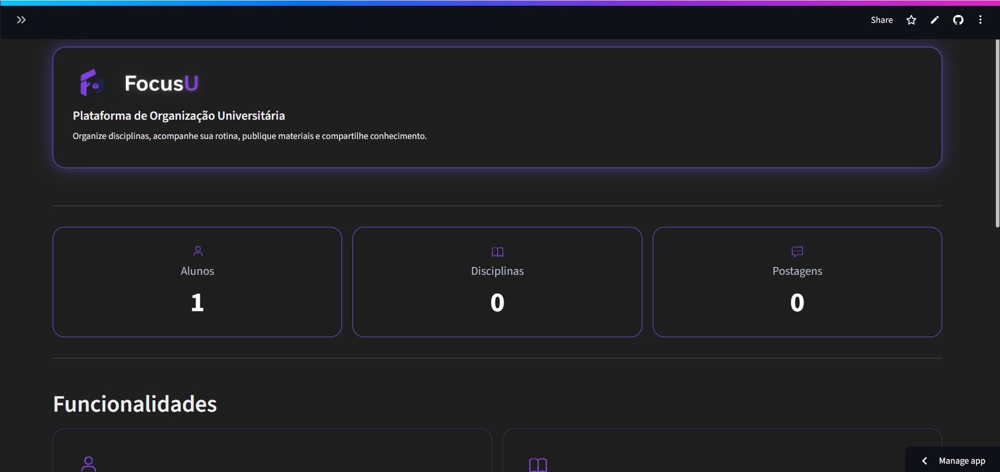
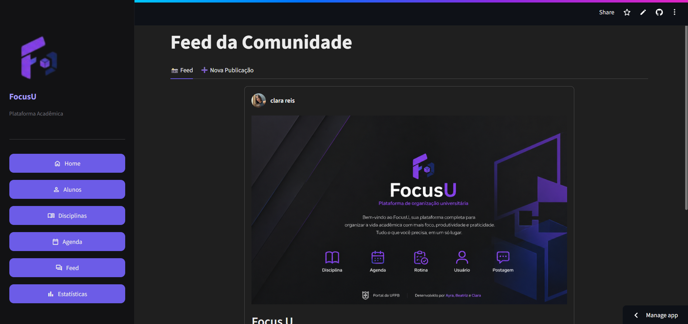
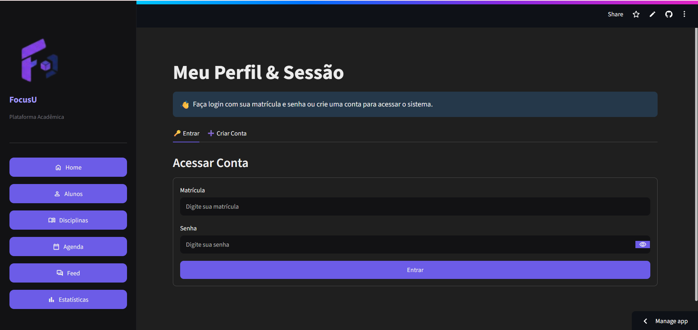
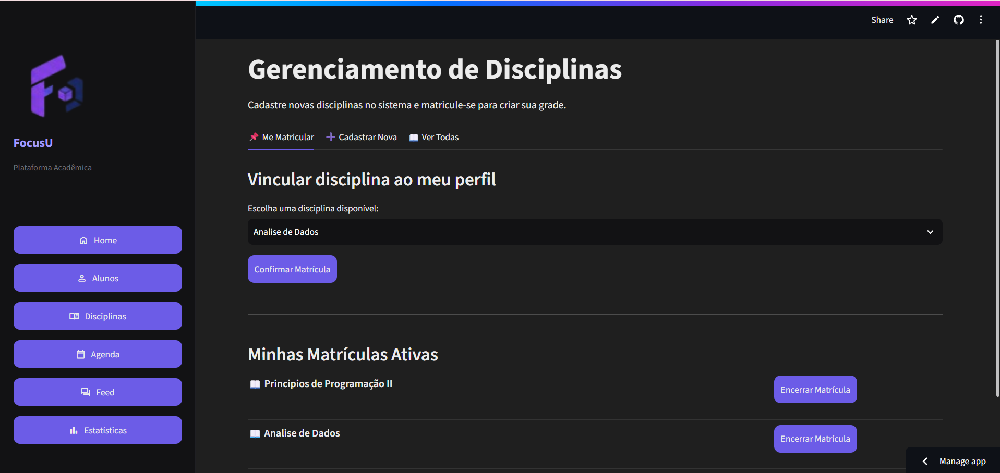
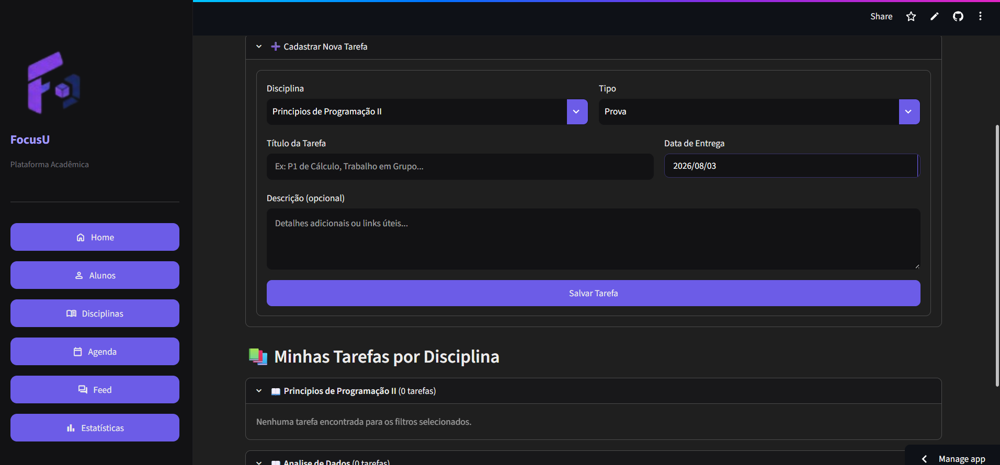
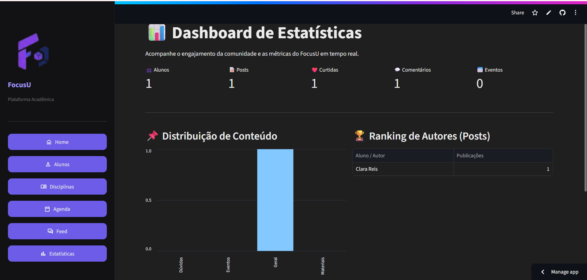

<div align="center">
  
  
  ### *Plataforma de Organização, Interação e Rede Social Universitária*

  [](https://www.python.org/)
  [](https://streamlit.io/)
  [](https://github.com/)
  [](https://github.com/)

  ---
  <p align="center">
    <b>Desenvolvido por:</b><br>
    Ayra &nbsp;·&nbsp; Beatriz &nbsp;·&nbsp; Clara Reis
  </p>
  ---
</div>

## 📌 Sobre o Projeto

O **FocusU** é um ecossistema acadêmico completo com **interface web interativa em Streamlit**, projetado para auxiliar estudantes universitários na gestão da sua rotina de estudos, acompanhamento de disciplinas e engajamento social.

A plataforma conecta a organização individual com a colaboração coletiva através de um **Feed estilo rede social** com fotos e comentários em tempo real, além de um **Dashboard de Estatísticas** completo para acompanhamento de métricas de engajamento da comunidade.

---
---

## 📸 Demonstração da Interface

<div align="center">

| 🏠 Home / Dashboard | 📸 Feed da Comunidade |
| :---: | :---: |
|  |  |

| 👨‍🎓 Gestão de Alunos | 📚 Gerenciamento de Disciplinas |
| :---: | :---: |
|  |  |

| 📅 Agenda Acadêmica | 📊 Estatísticas & Métricas |
| :---: | :---: |
|  |  |

</div>

## 🎨 Identidade Visual & Cores do Projeto

O sistema foi modelado seguindo a paleta de cores oficial e o design *dark mode* do **FocusU**:

* **Roxo Acadêmico (`#6C5CE7`):** Cor principal que representa o foco, sabedoria e ambiente universitário.
* **Lavanda Claro (`#A29BFE`):** Utilizado para realces de subseções e interfaces secundárias.
* **Verde Sucesso (`#00B894`):** Indicador de operações concluídas e cadastros bem-sucedidos.
* **Grafite / Dark Mode (`#121214` & `#2D3436`):** Base da interface web e estruturação dos cards no feed.

---

## 🚀 Funcionalidades Principais

* **Identidade e Cadastro Único:** Validação em tempo real que impede a duplicidade de Matrículas, Nomes de Usuário ou E-mails corporativos.
* **Gestão de Alunos e Disciplinas:** Cadastro centralizado com suporte a upload de fotos de perfil (Base64) e vínculo de professores às disciplinas.
* **📸 Feed da Comunidade:**
  * Postagens com upload de fotos no formato card escuro centralizado.
  * Suporte a múltiplos tipos de postagem (Geral, Dúvidas de Disciplina, Materiais de Estudo e Eventos).
  * Sistema de curtidas (`❤️`) e comentários em linha com identificação do autor logado.
* **📊 Dashboard & Estatísticas:**
  * Métricas em tempo real (KPIs de alunos, postagens, curtidas e comentários).
  * Gráfico interativo da distribuição de tipos de publicação.
  * Ranking dos autores mais ativos e destaque para a publicação mais engajada da comunidade.
* **Mecanismo de Exclusão Segura (Anonimização):** Proteção avançada. Ao remover uma conta, o cache de rotinas é limpo e as postagens públicas permanecem íntegras no feed convertidas para *"Usuário Anônimo"*.

---

## 🧠 Pilares de POO Implementados

O FocusU foi construído como consolidação prática dos conceitos avançados de **Programação Orientada a Objetos**:

* **Abstração e Interfaces:** Contratos abstratos via módulo `abc` para isolamento de comportamentos obrigatórios (Interface `Publicavel`).
* **Encapsulamento Rígido:** Proteção de atributos críticos (`_nome`, `_email`, `_matricula`, `_titulo`) usando getters e setters (`@property`) com validações rigorosas.
* **Herança & Polimorfismo Avançado:** Especializações de postagens (`PostagemDuvida` e `PostagemMaterial`) e eventos (`Evento`) com renderização dinâmica genérica (*Duck Typing*).
* **Gerenciamento de Memória & Estado:** Uso ativo de destruidores e métodos mágicos sincronizados com o estado global da aplicação web.

---

## 📁 Estrutura do Repositório

```text
FocusU/
│
├── .devcontainer/        # Configuração para desenvolvimento em containers
├── .streamlit/           # Configurações de tema e layout do Streamlit (config.toml)
│
├── docs/                 # Documentação técnica e diários de bordo
│   ├── diagrama_classes.md
│   ├── diario_de_bordo_clara.md
│   ├── diario_de_bordo_etapa3.md
│   ├── diario_de_bordo_frontend.md
│   ├── diario_de_bordo_recursão.md
│   └── FocusU.pdf
│
├── images/               # Logo e elementos visuais da documentação
│   └── logo_focusu.png
│
├── src/                  # Código-fonte principal da aplicação
│   ├── exceptions/       # Tratamento de exceções customizadas (exceptions.py)
│   ├── interfaces/       # Interfaces e contratos abstratos (publicavel.py)
│   ├── models/           # Entidades de negócio (usuario.py, postagem.py, disciplina.py, evento.py, etc.)
│   ├── system/           # Gerenciador do sistema e regras de negócio (sistema.py)
│   ├── utils/            # Módulos utilitários (helpers.py, persistencia.py)
│   └── web/              # Interface Web em Streamlit (interface_web.py, paginas.py, css.py, components.py)
│
├── tests/                # Suíte de testes unitários (test_sistema.py, test_tabela_hash.py)
│
├── main.py               # Ponto de entrada / execução via CLI ou bootstrap
├── requirements.txt      # Dependências do projeto
├── .gitignore            # Arquivos ignorados pelo Git
└── README.md             # Documentação oficial do projeto
```

## 💻 Como Executar o Projeto
Siga os passos abaixo para clonar o repositório, configurar o ambiente local e rodar a aplicação web do FocusU.

Pré-requisitos
Python 3.10 ou versão superior.

Git instalado.

### ⚙️ Passo a Passo
1. Clonar o Repositório

```Bash
git clone [https://github.com/Clarareis03/FocusU.git](https://github.com/Clarareis03/FocusU.git)
cd FocusU
```
3. Criar e Ativar Ambiente Virtual (Recomendado):
```Bash
# Windows
python -m venv venv
venv\Scripts\activate

# Linux / macOS
python3 -m venv venv
source venv/bin/activate
```
2. Instalar as Dependências
Certifique-se de instalar as bibliotecas necessárias:

```Bash
pip install -r requirements.txt
```

3. Executar a Aplicação Web
Execute a interface web no navegador rodando o comando a partir da raiz do repositório:

No Windows / Linux / macOS:

```Bash
streamlit run src/web/interface_web.py
A aplicação abrirá automaticamente no seu navegador no endereço http://localhost:8501.
```

## 🛠️ Resolução de Problemas Comuns
ModuleNotFoundError (NameError ou Erro de Importação):
Certifique-se de rodar o comando streamlit run sempre estando na raiz da pasta /FocusU.

Erro de carregamento das imagens:
As imagens de perfil e dos posts são convertidas em cadeias Base64. Certifique-se de enviar arquivos nos formatos válidos (.jpg, .jpeg ou .png).