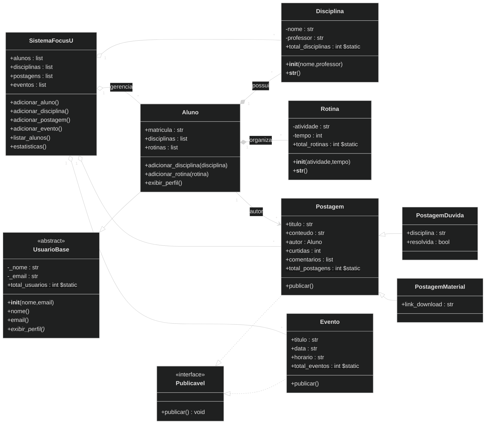

```mermaid
---
config:
  theme: dark
---
classDiagram
direction LR

%%==========================
%% CLASSES
%%==========================

class Publicavel {
    <<interface>>
    +publicar() void
}

class UsuarioBase {
    <<abstract>>
    -_nome : str
    -_email : str
    +total_usuarios : int $static$
    +__init__(nome,email)
    +nome()
    +email()
    +exibir_perfil()*
}

class Aluno {
    +matricula : str
    +disciplinas : list
    +rotinas : list
    +adicionar_disciplina(disciplina)
    +adicionar_rotina(rotina)
    +exibir_perfil()
}

class Disciplina {
    -nome : str
    -professor : str
    +total_disciplinas : int $static$
    +__init__(nome,professor)
    +__str__()
}

class Rotina {
    -atividade : str
    -tempo : int
    +total_rotinas : int $static$
    +__init__(atividade,tempo)
    +__str__()
}

class Postagem {
    +titulo : str
    +conteudo : str
    +autor : Aluno
    +curtidas : int
    +comentarios : list
    +total_postagens : int $static$
    +publicar()
}

class PostagemDuvida {
    +disciplina : str
    +resolvida : bool
}

class PostagemMaterial {
    +link_download : str
}

class Evento {
    +titulo : str
    +data : str
    +horario : str
    +total_eventos : int $static$
    +publicar()
}

class SistemaFocusU {
    +alunos : list
    +disciplinas : list
    +postagens : list
    +eventos : list
    +adicionar_aluno()
    +adicionar_disciplina()
    +adicionar_postagem()
    +adicionar_evento()
    +listar_alunos()
    +estatisticas()
}

%%==========================
%% HERANÇA
%%==========================

UsuarioBase <|-- Aluno
Postagem <|-- PostagemDuvida
Postagem <|-- PostagemMaterial

%%==========================
%% INTERFACE
%%==========================

Publicavel <|.. Postagem
Publicavel <|.. Evento

%%==========================
%% COMPOSIÇÃO
%%==========================

Aluno "1" *-- "*" Disciplina : possui
Aluno "1" *-- "*" Rotina : organiza

%%==========================
%% AGREGAÇÃO
%%==========================

SistemaFocusU "1" o-- "*" Aluno : gerencia
SistemaFocusU "1" o-- "*" Disciplina
SistemaFocusU "1" o-- "*" Evento
SistemaFocusU "1" o-- "*" Postagem

%%==========================
%% ASSOCIAÇÕES
%%==========================

Aluno "1" --> "*" Postagem : autor

```